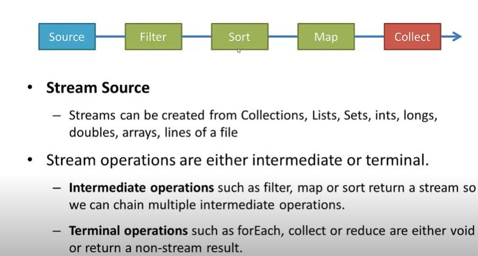

# Functional-Programming

> Lambda
> Stream
> Collections


https://github.com/in28minutes/functional-programming-with-java

### Java Brains:
https://www.youtube.com/watch?v=gpIUfj3KaOc&list=PLqq-6Pq4lTTa9YGfyhyW2CqdtW9RtY-I3

## Functional Interface
- Interface with only one method declaration in it.
> Ex:
```java
public interface Comparable<T> {
	public int compareTo(T o);
}
```
## Lambda
- Any method which is taking Functional interface as input can be supplied with Lambda Expressions.
- Lambda in other words are mainly to supply the behaviour.
- internally Lambda are similar to anonymous inner classes.
- if we will try to instantiate any interface it will force to provide the default implementation. Similar way, Lambdas are directly
sort way of writing the implementation of the interface.
- Complier is smart enough to identify the input data types, output data types.

> Note:
- As we know Lambda are other of inner class and as per Java initial rule we can't use non final data member inside inner classes.
hence part of Lambda enclosing scope we can't modify local data members.
- Even though we can still use the class level data members to modify inside enclosing scope as local data members 
are part of Stack where class level data members part of heap.  

```java
public void test() {
		int count=0;
		new Thread(()->{
			count++;
			//Local variable count defined in an enclosing scope must be final or effectively final
		});
	}
```

```java

p->System.out.println(p.getFirstName());

: Where p is a person class object


public int getSum(int a, int b){
	return a+b;
}

> Lambda:
(a,b)-> a+b;

```

## Stream
- as word self define, a flow of data and you want to apply kind of Filter, Map, Colleciton, Sorting on same.
- Internally Stream is part of Collection interface and used Spliterator to convert the collection or other data into Stream.
- there are intermideate and terminal operations. 
> Intermediate Operations: Can apply multiple.
- Filter, Map, Sort, skip, findFirst, anyMatch, distinct, flatMap
> Terminal Operation: Only one terminal operation is allowed.
- count, max, min, reduce

> Stream Examples
https://www.youtube.com/watch?v=t1-YZ6bF-g0




