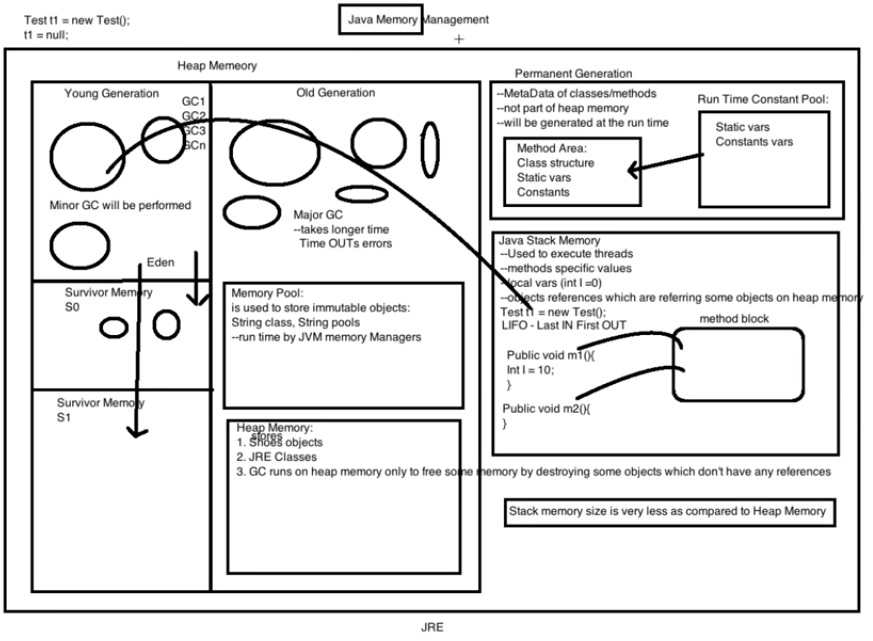

### Memory Architecture in Java:
- **Partitions**
	- **Heap:** holding all the objects. All JRE classes and objects will be in Heap
		- Young Gen
			- Eden: Initial object will be created in this space and will shift to S0, S1 if Eden is full.
			- Survivor 0
			- Survivor 1
		- Old Gen
			- Memory Pool: Stores immutable objects like String. 
	- **Permanent Generation:** Holding meta data.
		- Method Area: holding class or methods strct.	
		- Run Time Const Pool: static vars, const.
	
	- **Stack:**
		- Per thread there will be one stack.
		- All the local variables or references or method calls will be part of Stack.
		- Method Block: used to allocate for method execution and will be release once method is done and given to other method.
		

- GC only runs on Heap memory.
- Minor GC: It runs in young space to collect objects to shift from Eden to S0, S1 and so on.
- Minor GC will increment count of object by one each time its moving from one space to other. Also it will increase till 15 before object moved from Young to Old Gen space.
- Major GC: runs for long time hence not invoked frequently.
- In case of large objects it will be created directly in Heap Old Gen Space.
- Stack memory is very less compare to Heap Memory.

---

### Why Wait and Notify is part of Object Class?
- wait - wait method tells the current thread to give up monitor(Key) and go to sleep.
- notify - Wakes up a single thread that is waiting on this object's monitor. 
- ***So you see wait() and notify() methods work at the monitor(Key) level, thread which is currently holding the monitor is asked 
to give up that monitor through wait() method and through notify method (or notifyAll) threads which are waiting on the 
object's monitor are notified that threads can wake up.***
- Important point to note here is that monitor is assigned to an object not to a particular thread. 
That's one reason why these methods are in Object class. To reiterate threads wait on an Object's monitor (lock) and 
notify() is also called on an object to wake up a thread waiting on the Object's monitor.

---

### How to prevent Deadlock in multi-threading ?
- ***Avoid Unnecessary Locks:*** We should use locks only for those members on which it is required. Unnecessary use of locks leads to a deadlock situation. We recommend you to use a lock-free data structure. If possible, keep your code free form locks. For example, instead of using synchronized ArrayList use the ConcurrentLinkedQueue.
- ***Avoid Nested Locks:*** Another way to avoid deadlock is to avoid giving a lock to multiple threads if we have already provided a lock to one thread. Since we must avoid allocating a lock to multiple threads.
- ***Using Thread.join() Method:*** You can get a deadlock if two threads are waiting for each other to finish indefinitely using thread join. If your thread has to wait for another thread to finish, it's always best to use join with the maximum time you want to wait for the thread to finish.
- ***Use Lock Ordering:*** Always assign a numeric value to each lock. Before acquiring the lock with a higher numeric value, acquire the locks with a lower numeric value.
- ***Lock Time-out:*** We can also specify the time for a thread to acquire a lock. If a thread does not acquire a lock, the thread must wait for a specific time before retrying to acquire a lock.

---

### Chain of Responsibility Design:
- Chain of responsibility pattern is used to achieve loose coupling in software design where a request from the client is passed to a chain of objects to process them. Later, the object in the chain will decide themselves who will be processing the request and whether the request is required to be sent to the next object in the chain or not.
- An example: Filters in web application arranged in chain and each filter takes the decision wheather request needs to pass to the next or not...

---

### Difference between Request Redirect and Forward
- Forward will pass the same request to the different resource and URL will remain same at client end.
- Where Request Redirect or SendRedirect will built a new request and fwd to resource from client end. and hence due to dual round trip it is slower than forward.

--- 

### What is Mutation Testing?
- code coverage metrics can sometimes be quite ineffective, because a 100% code coverage score only means that all lines were exercised at least once, but it says nothing about tests accuracy or use-cases completeness, and that's why mutation testing actually matters.
- Mutation testing is a testing technique used to improve the adequacy of tests and identify defects in code. 
- ***The idea is to change the production code dynamically and cause the tests to fail.***
- ***Good tests shall fail***
- Each change in the code is called a mutant, and it results in an altered version of the program, called a mutation.
- We say that the mutation is killed if it can cause a fail in the tests. We also say that the mutation survived if the mutant couldn't affect the behavior of the tests.
- https://www.baeldung.com/java-mutation-testing-with-pitest 
---

### Performance Testing
- Tools like Chaos Monkey using Jmeter for local performance testing. and load runner for a load testing signoff.
- ***Latency Assault:*** adds random latency to the request
- ***Exception Assault:*** throws random Runtime Exception
- ***AppKiller Assault:*** um, the app dies
- https://www.baeldung.com/spring-boot-chaos-monkey
---

### Difference between RestController and Controller
- Controllers are made to handle MVC design pattern. and maid to return Views.
- In case of data, it needs to specify with @ResponseBody explicitly.
- Where @RestController is the default annotated with @Controller and @ResponseBody and default capable to handle the text response.
---

### Microservices Factors/Principles
- ***Admin Segregation***
- ***Backing Services:*** app should treat all such backing services as attached resources. Ex: JPA
- ***Build Release Run:*** There should be isolation between dev and build and deployment.
- ***CodeBase:*** an app should be tracked in a single code repository and must not share that repository with any other apps.
- ***Concurrency:*** Service should not have instance dependencies. So in case of scaling app should be able to distribute load among.
- ***Configuration:*** app should externalize all such configurations that vary between deployments.
- ***Dependencies:*** twelve-factor app should always explicitly declare all its dependencies
- ***Dev/Prod Party:*** gap between development and production environment as minimal as possible.
- ***Disposableity:*** 
- ***Keep Stateless:*** App should be independent from session context.
- ***Self Container:*** Ms is enabled with its own container and can run in any system with compatible JRE version.
- ***Logs:*** app separates itself from log generation and its processing.
---
- ***I***nterface Segregation
- ***D***eployability
- ***E***vent Driven
- ***A***vailablity over consistency
- ***L***oose coupling
- ***S***ingle Responsibility
---

### System Design Principles:
- ***S***ingle Responsibility
- ***O***pen Close
- ***L***iskov Substitutional
- ***I***nterface Segregation
- ***D***ependency Inversion
---
- ***DRY*** Do Not Repeat Yourself, Ex: Rest Template
---
- ***KISS*** Keep It Simple, Stupid: Keep code modular and simplet to understand or read.
---

### Char array over String to save password?
- To prevent by mistake logging or printing password readability.
- Char array can be written with new data in same reference. so security from orphan strings in memory.
- Strings are immutable and can't be changed, so making any changes will create new object where old one will remain in memory until not garbage collected.
---

### Memory Leakage in Java
- GC runs to collect all the non referenced objects from Heap. While if there are un-referenced objects available in Heap and GC is unable to collect the same which leads the Memory leakage.
- There can be multiple reasons as fe of them highlighted below.
- 1. ***Static Data Members:*** As static data members are part of PermGgen(MethodArea) are not eligible for GC. 
- 2. ***Through Unclosed Resources:*** Use resources with "try with resources" or with try and finally to make sure them to close.
- 3. ***Improper equals() and hashCode() :*** In case of using Hashmap or Hibernate caching, and hashcode-equals not implemented correctly there may be mulitple same objects be added in cache. 
- 4. ***Finalize():*** using finalize will stop GC to collect object immediately.
- 5. ***Non static Inner classes:*** even after our containing class' object goes out of scope, it will not be garbage collected.
- 6. ***ThreadLocal:*** in webserver its not everytime new thread is created, and if anything set in thread-local and not removed explicitly it will remain part of Thread even request is completed.
---

### 

