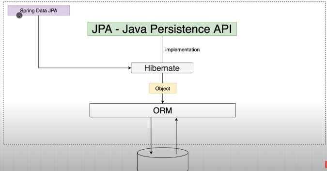

# Spring Data
- Project from Spring to connect Database.

-

- Dependencies:
```xml
<dependency>
   <groupId>org.springframework.boot</groupId>
   <artifactId>spring-boot-starter-data-jpa</artifactId>
   <!--Recommanded to use default version from Boot, Latest available is 2.4.1
</dependency>

// In case of H2:
<dependency>
    <groupId>com.h2database</groupId>
    <artifactId>h2</artifactId>
</dependency>

//With Different DB like MariaDB it needs specific dependency.
<dependency>
   <groupId>org.mariadb.jdbc</groupId>
   <artifactId>mariadb-java-client</artifactId>
   <scope>runtime</scope>
</dependency>
```


 