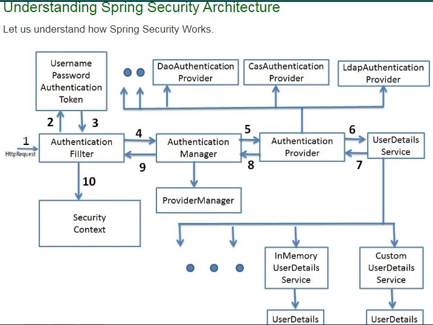

# Spring-Boot-Security

##
- https://www.youtube.com/watch?v=rBNOc4ymd1E



## Dependency: Authentication and Authrization
```xml
<dependency>
    <groupId>org.springframework.boot</groupId>
    <artifactId>spring-boot-starter-security</artifactId>
    <version>2.4.2</version>
</dependency>
```

## Classes in use and flow:
- Enabling the web security and binding the User details object to fetch the user details.
 
```java
Imp Classes and annotations:

@EnableWebSecurity: to enable web spring security.

// Class to define the Spring security lifecycle methods.
- SecurityConfigClass extends WebSecurityConfigurerAdapter
	//Method to Register the UserDetailService to fetch the user from underline systems like DB/LDAP and others.
	protected void configure(AuthenticationManagerBuilder auth) throws Exception {
		auth.userDetailsService(customUserDetailService);
	}
	
	//Method to bind the resource/url matchers, authentication and permissions.
	protected void configure(HttpSecurity http) throws Exception 


//Class to bind the logic to fetch the user details.
- CustomeUserDetailService implements UserDetailsService
	- UserDetails loadUserByUsername(String username) throws UsernameNotFoundException;

- Password Encoder: While storing the password in system or authenticating the user, Spring will use the Encoder.
	- 	BCryptPasswordEncoder is the strong and best one as it does maintain its salt internally.
	-	@Bean
		public PasswordEncoder encoder() {
		    return new BCryptPasswordEncoder();
		}
	- https://www.baeldung.com/spring-security-registration-password-encoding-bcrypt
```

- CustomUserDetailsService extends the UserDetailsService.

- Example:
```java
@Repository
public class CustomUserDetailService implements UserDetailsService {

//This one can be linked to any JPA repo to fetch the user details from DB. or LDAP or any other service directory.

	@Override
	public UserDetails loadUserByUsername(String username) throws UsernameNotFoundException {
		return new User("Suhail", "Suhail", new ArrayList<>());
	}
}
```

